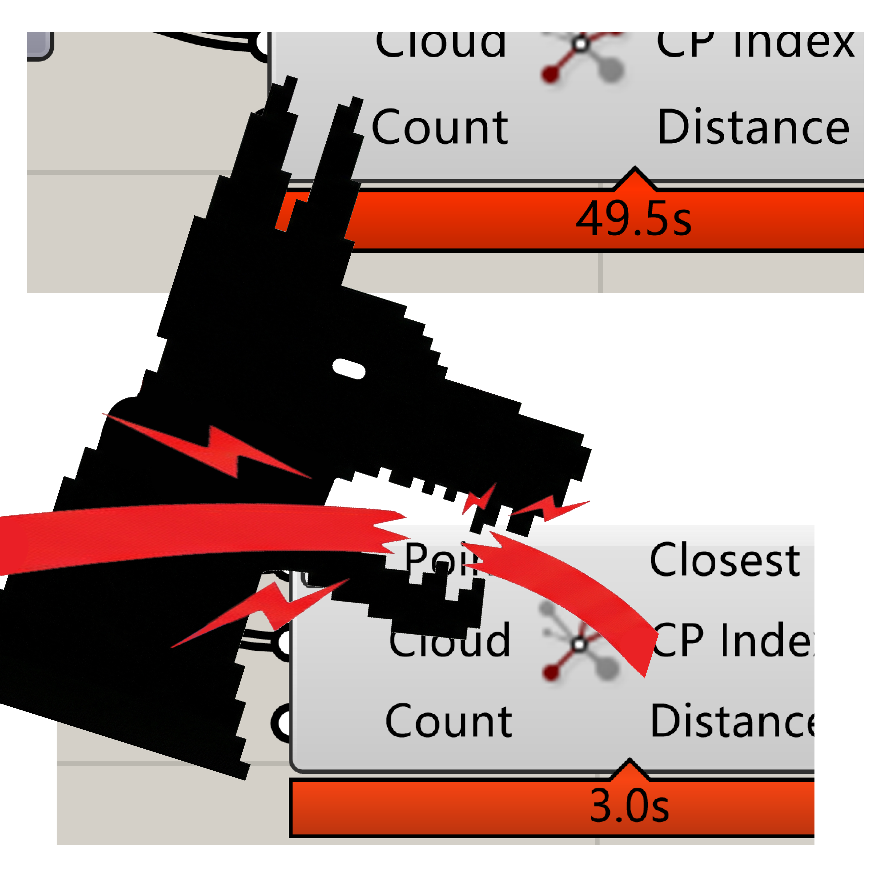
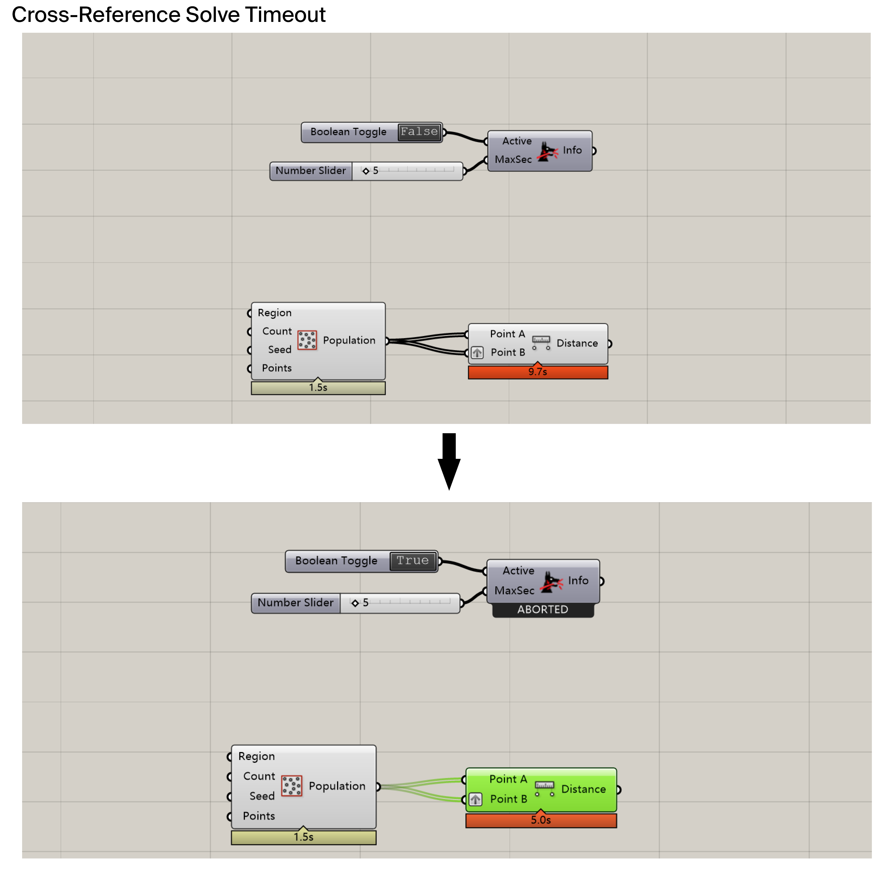
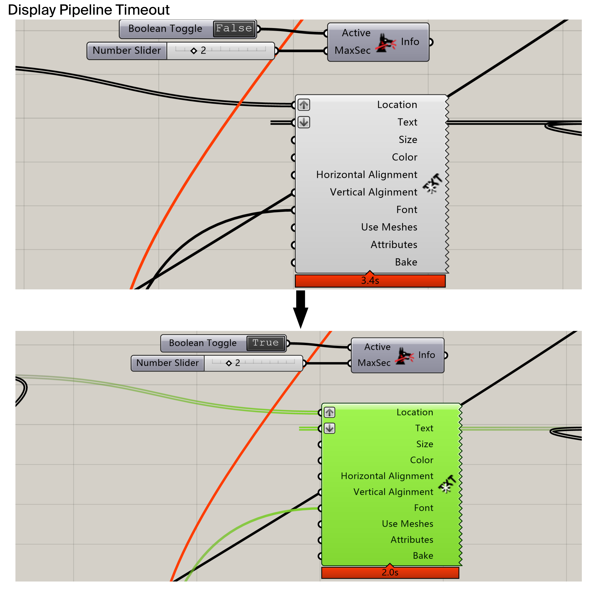
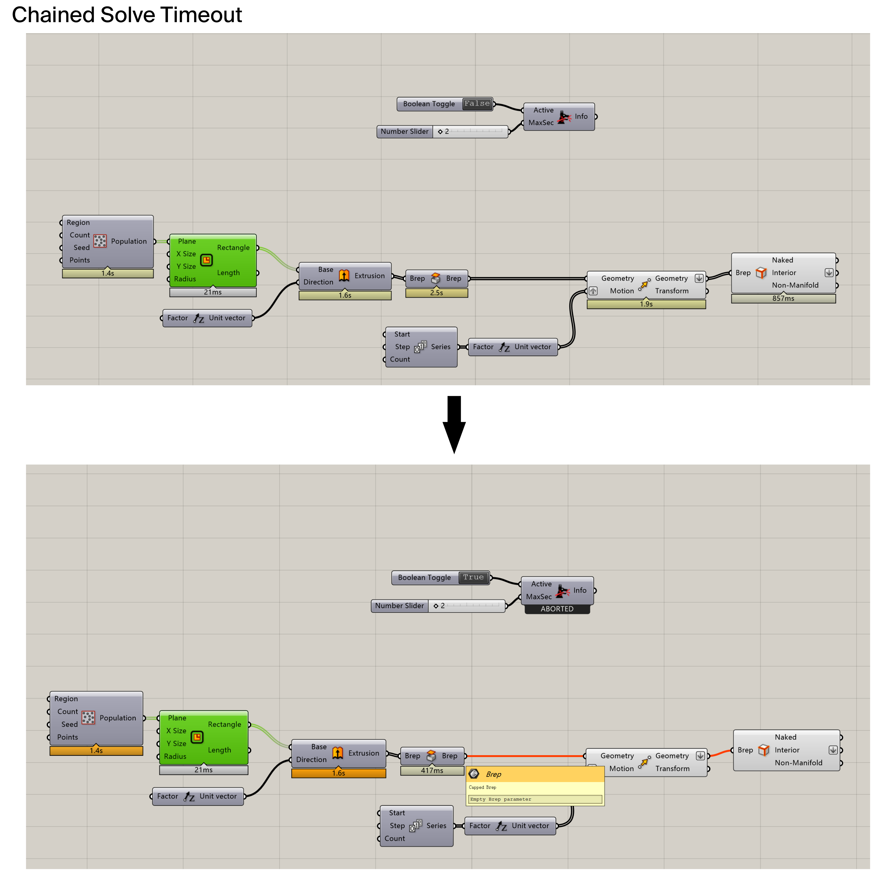
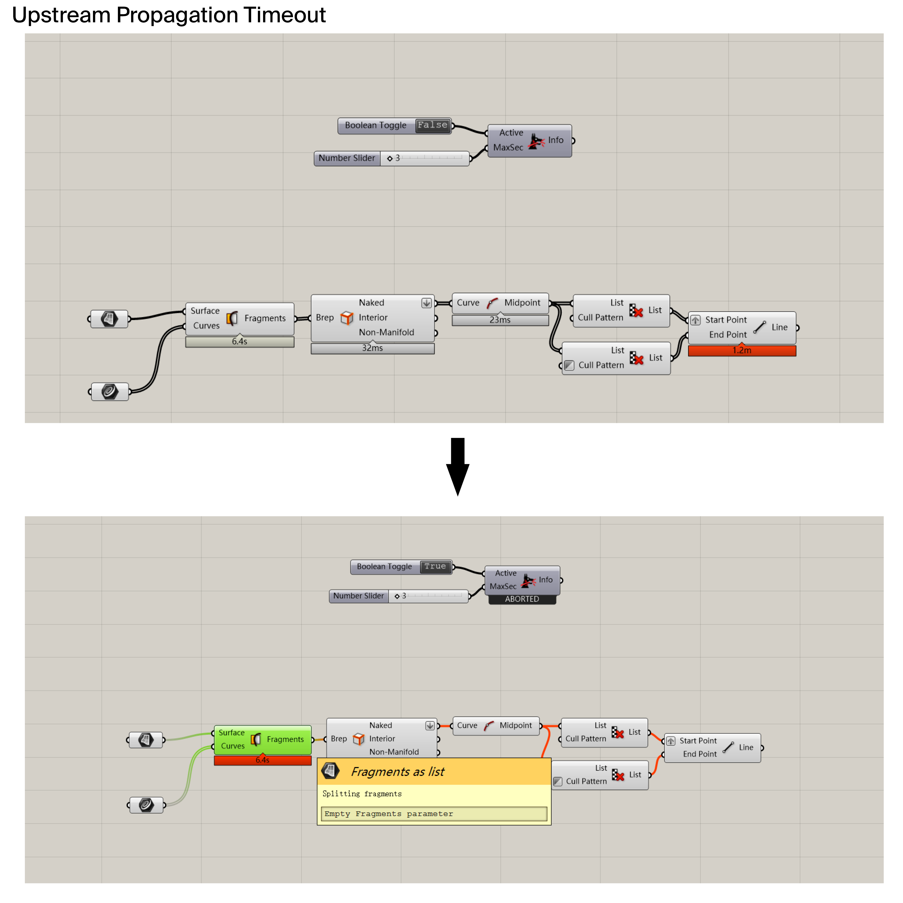
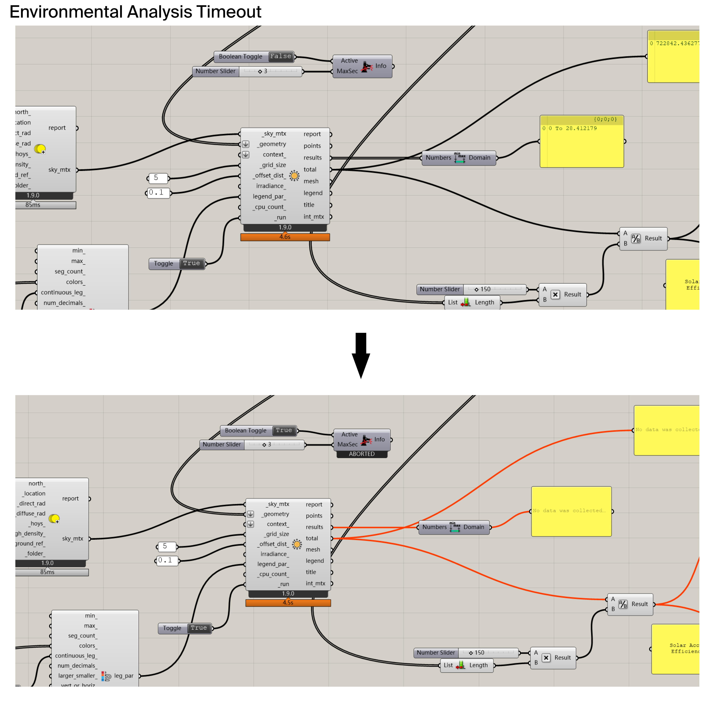
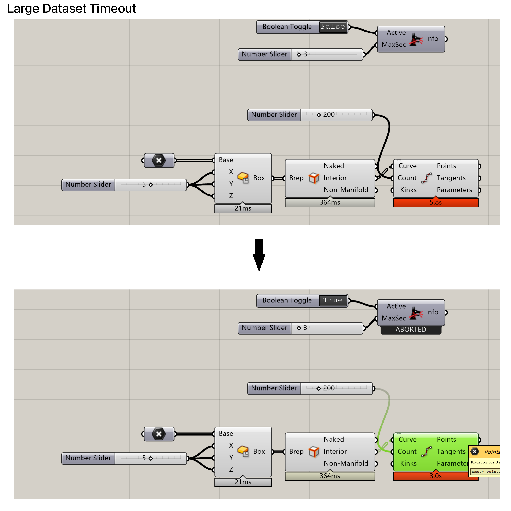
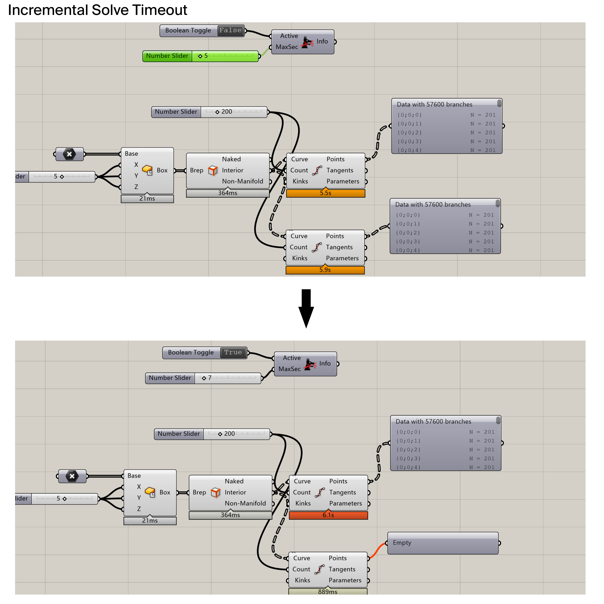

# Watchdog
  

### 🐶 Watchdog for Grasshopper Prevent Rhino & Grasshopper from freezing due to accidental massive computations or cascading calculation chains.

Watchdog is a lightweight utility plugin for Grasshopper that acts as a "circuit breaker" for your parametric definitions. It monitors the solution time in real-time and forcibly aborts the computation if it exceeds your specified limit.

🚫 No more "End Task" in Task Manager.

🚫 No more interrupting your logic building flow due to a "unanticipation".

🚫 No more restarting Rhino & Grasshopper every time it crashes.

# 📦 Installation  
Download the latest .gha file from the Releases section (or [Food4Rhino](https://www.food4rhino.com/en/app/watchdog)), or install it directly via the Rhino Package Manager by searching for "Watchdog".

Open Grasshopper and go to File -> Special Folders -> Components Folder.

Paste the Watchdog.gha file into this folder.

⚠️ IMPORTANT: Right-click the file -> Properties -> Check Unblock (Apply).

If you skip this, the plugin will not load on Windows.

Restart Rhino.

# 🚀 Usage
Find the component under the Params tab -> Util group.

Place Watchdog anywhere on your canvas (it works globally).

Active: Set a Boolean Toggle to True.

MaxSec: Set your safety limit in seconds (e.g., 5 or 10).

Note: Keep Watchdog Active = False while you are intentionally running a heavy simulation (like a final render or FEM analysis), then switch it back to True with ideal time limit for daily parametric modeling.
---

# 🧪 Typical Crash Scenario Live Tests

1. Cross-Reference Solve Timeout  
	In this scenario, a combinatorial explosion occurs due to Cross-Reference inputs and Data Tree structures adjusting.  
	

2. Display Pipeline Timeout  
	In this scenario, the Rhino viewport freezes due to an overload in the display pipeline. This usually happens when simultaneously rendering heavy 3D Text, dense geometry, and complex materials. Watchdog detects the display lag and aborts the preview process to restore responsiveness.  

	  
3. Chained Solve Timeout  
	In this scenario, while individual components execute quickly, incorrect data inputs can cause the overall runtime to become excessive. Watchdog monitors the global solution time and aborts the current operation if the total duration exceeds the limit, preventing a potential crash.  
	  
4. Upstream Propagation Timeout  
	Tests the scenario where a heavy upstream component exceeds the time limit. Watchdog attempts to abort it immediately. If the component is uninterruptible (atomic), Watchdog cuts off the subsequent calculation chain immediately after completion to prevent heavy data from propagating downstream.  
	 
5. Environmental Analysis Timeout  
	Demonstrates control over heavy third-party components (e.g., environmental analysis tools). Although some external solvers are atomic and cannot be interrupted mid-process, Watchdog successfully blocks the downstream propagation of data immediately after the component finishes, preventing further system lock-ups.  
	 
6. Large Dataset Timeout
	Tests the monitoring capability on massive data structure calculations. Watchdog tracks the processing time of huge datasets (e.g., millions of list items or complex Data Trees) and successfully interrupts the operation when the timeout limit is reached.  
	 
7. Incremental Solve Timeout
	Demonstrates how the time limit applies sequentially across sibling components. With a 7-second global limit, the first 5-second operation completes successfully, but the second identical operation is aborted mid-process as the cumulative time exceeds the threshold.  
	 

# 🛑 Limitations (How it works)
Watchdog is designed to kill Iterative Processes.

✅ What it fixes: Loops, List matching, Data Tree operations, and massive object counts (e.g., 10,000 spheres).

⚠️ What it cannot fix: Single "Atomic" operations. If you feed one single, extremely complex solid into a Boolean Union component, the calculation happens inside the C++ geometry kernel and cannot be interrupted until that single step is finished.  

# 📄 License
This project is open-source and licensed under the MIT License.
